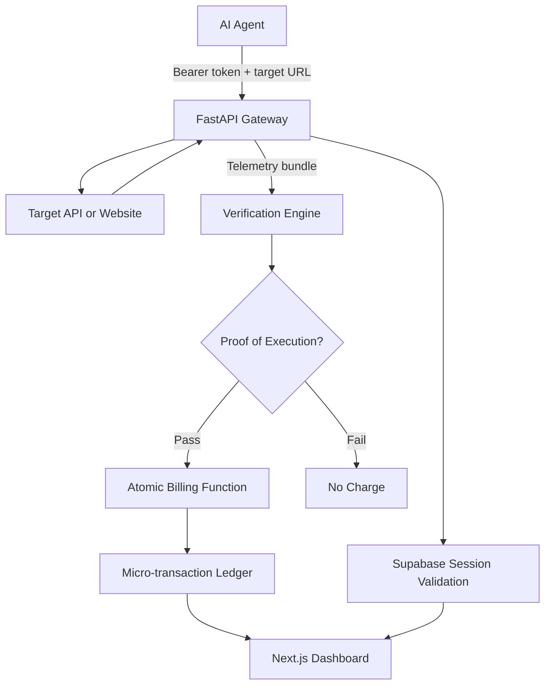

# AI Agents Internet Billing

Outcome-priced internet access for autonomous AI agents.

## One-Sentence Summary

This project is a billing gateway that lets AI agents pay for useful web/API results only after a verification engine confirms that the response was actually successful.

AI Agents Internet Billing is an outcome-verified billing platform for AI agents that consume paid web data and APIs. Instead of charging an agent simply because it made an HTTP request, the system routes the request through a gateway, verifies that the response was useful, coherent, and successful, and only then writes a micro-transaction to a ledger.

The project is built as a working prototype for a future internet where agents browse, query, scrape, and call APIs on behalf of users. Data providers need a way to get paid, agent developers need spend controls, and both sides need confidence that billing reflects real value instead of failed requests, bot blocks, empty responses, or hallucinated content.

## What It Is

At a high level, this is a reverse proxy plus verification and wallet system:

1. An AI agent sends a request to the gateway with a bearer token.
2. The gateway authenticates the agent session against Supabase.
3. The gateway forwards the request to the target API or website.
4. The gateway captures request and response telemetry.
5. A verification engine grades whether the response counts as a real execution.
6. If verification passes, the ledger atomically debits the developer wallet and records a micro-transaction.
7. A dashboard lets developers create tokens, fund wallets, inspect usage, and monitor spend.

The main product idea is **Proof-of-Execution billing**: charge for verified successful outcomes, not raw traffic.

## Why I Built It

AI agents are going to interact with the internet differently than humans do. They may make many small data requests while planning, researching, comparing prices, filling forms, or answering user questions. Traditional API billing counts requests, but that model breaks down when a request can fail because of anti-bot pages, hallucinated fallbacks, empty bodies, loops, or irrelevant content.

This project explores a billing primitive for that environment:

- Agent developers prepay into a wallet.
- Providers define rates for successful executions.
- The platform only bills when an execution is verified.
- Every charge is explainable with metadata, scores, flags, and request fingerprints.

## Core Features

- **Outcome-based charging** so developers are billed for verified useful responses rather than every attempted request.
- **FastAPI reverse proxy** for agent HTTP traffic.
- **Bearer-token agent sessions** with SHA-256 hashed token storage.
- **Supabase authentication and ledger storage** for developers, sessions, providers, endpoints, and transactions.
- **Proof-of-Execution verification** using either a Gemini LLM judge or local heuristic fallbacks.
- **Atomic Postgres billing function** to prevent partial writes and double-charging.
- **Loop detection** based on request fingerprints and session strike counts.
- **Per-developer rate limiting** in the gateway.
- **Telemetry truncation** to protect the verification service from oversized bodies.
- **Next.js developer dashboard** for sign-in, wallet balance, API key generation, top-ups, and transaction history.
- **Stripe Checkout integration** for wallet credits.
- **Docker Compose orchestration** for the gateway and verification services.
- **Pytest coverage** for the core evaluator pipeline.

## Architecture



The architecture is event-oriented: the gateway handles user-facing latency, while verification and ledger writes run behind the request path so the agent can receive the upstream response without waiting for billing work to finish.

The services are intentionally split:

- `gateway/` owns authentication, proxying, request capture, rate limits, and loop blocking.
- `verification/` owns Proof-of-Execution scoring and billing decisions.
- `schema/` owns the Supabase/Postgres data model and billing RPCs.
- `dashboard/` owns the developer-facing product interface.
- `scripts/` contains local simulation utilities.
- `docs/` contains deeper architecture and pitch material.

## Technology Stack

### Backend Gateway

- **Python**
- **FastAPI**
- **httpx** for async upstream proxy requests
- **Pydantic settings** for environment configuration
- **Supabase Python client** for session and account reads
- **Docker** for containerized deployment

The gateway is the enforcement layer: it decides whether a request is allowed to leave the system, captures the minimum telemetry needed for verification, and protects the rest of the stack from obvious abuse.

### Verification Engine

- **Python**
- **FastAPI**
- **Google Gen AI SDK / Gemini** for LLM-as-a-judge verification
- **Heuristic fallback evaluators** for local or no-key operation
- **pytest** for evaluator tests

### Database and Billing Ledger

- **Supabase**
- **Postgres**
- **Row-Level Security policies**
- **PL/pgSQL billing functions**
- **Partitioned `micro_transactions` ledger table**
- **JSONB proof metadata**

### Dashboard

- **Next.js**
- **React**
- **TypeScript**
- **Tailwind CSS**
- **Supabase SSR auth**
- **Stripe Checkout and webhooks**

### Local Infrastructure

- **Docker Compose**
- Separate containers for:
  - `gateway` on port `8000`
  - `verification` on port `9000`

## Repository Layout

```text
.
├── dashboard/              # Next.js developer dashboard
│   ├── app/                # App Router pages and API routes
│   ├── components/         # Dashboard UI components
│   └── lib/supabase/       # Supabase browser/server clients
├── docs/
│   ├── architecture.md     # Mermaid architecture diagram and data flow
│   └── pitch_deck.md       # Product pitch notes
├── gateway/                # FastAPI reverse proxy
│   ├── main.py             # Auth, proxying, loop checks, telemetry capture
│   ├── verification_client.py
│   ├── models.py
│   ├── config.py
│   └── Dockerfile
├── schema/                 # Supabase/Postgres migrations
├── scripts/                # Local agent simulation scripts
├── verification/           # Proof-of-Execution engine
│   ├── main.py
│   ├── judge.py            # Gemini judge integration
│   ├── evaluators.py       # Heuristic fallback scoring
│   ├── ledger.py           # Atomic transaction writer
│   ├── models.py
│   └── tests/
└── docker-compose.yml
```

## How The Billing Flow Works

### 1. Developer Creates An Agent Token

The dashboard creates an `agent_sessions` row and returns a raw bearer token exactly once. The raw token is never stored. The database stores only a SHA-256 hash.

### 2. Agent Sends A Proxied Request

The agent calls:

```bash
curl -X GET "http://localhost:8000/proxy?__target=https://httpbin.org/get" \
  -H "Authorization: Bearer <your-agent-token>" \
  -H "X-Agent-Intent: Fetch data to answer the user" \
  -H "Accept: application/json"
```

The gateway also supports `X-Target-Url` as an alternative to the `__target` query parameter.

### 3. Gateway Validates And Forwards

The gateway:

- extracts the bearer token
- hashes it
- validates the session in Supabase
- checks wallet balance and developer status
- applies per-developer rate limits
- fingerprints the request for loop detection
- forwards the request to the target URL
- captures a bounded telemetry bundle

### 4. Verification Engine Grades The Execution

The verification service receives the telemetry bundle and grades it with:

- HTTP status checks
- non-empty body checks
- hallucination/refusal detection
- content-type coherence checks
- loop/recursive URL signals
- optional Gemini LLM judge scoring

If `GEMINI_API_KEY` is present, Gemini is used as the primary judge with structured function calling. If the model call fails or no key is configured, the system falls back to deterministic local evaluators.

### 5. Ledger Writes A Charge Only On Success

When `proof_of_execution == true`, the ledger:

- resolves the matching provider endpoint
- computes the provider and platform shares
- calls the Postgres `bill_agent_execution` RPC
- debits the developer wallet
- inserts a `micro_transactions` row with proof metadata

Failed or low-confidence executions do not bill the developer.

## Database Model

The Supabase schema includes:

- `agent_developers`: developer accounts, wallet balances, account status
- `agent_sessions`: agent tokens, request counters, loop state
- `data_providers`: APIs or websites being monetized
- `api_endpoints`: provider endpoint patterns and pricing overrides
- `micro_transactions`: append-only verified execution ledger

The ledger is partitioned by `created_at` so high-volume transaction history can scale by month. Row-Level Security lets developers read only their own sessions and transactions, while backend services use the service role for trusted writes.

## Running Locally

Create your environment file:

```bash
cp .env.example .env
```

Fill in at least:

```bash
SUPABASE_URL=
SUPABASE_SERVICE_KEY=
INTERNAL_SECRET=
```

Optional dashboard/payment/model settings include:

```bash
GEMINI_API_KEY=
STRIPE_SECRET_KEY=
STRIPE_WEBHOOK_SECRET=
NEXT_PUBLIC_SUPABASE_URL=
NEXT_PUBLIC_SUPABASE_ANON_KEY=
NEXT_PUBLIC_GATEWAY_URL=
NEXT_PUBLIC_APP_URL=
```

Apply the SQL migrations in `schema/` to Supabase in order:

```bash
psql "$DATABASE_URL" < schema/001_initial.sql
psql "$DATABASE_URL" < schema/002_billing_function.sql
psql "$DATABASE_URL" < schema/003_auth_trigger.sql
psql "$DATABASE_URL" < schema/004_helper_functions.sql
psql "$DATABASE_URL" < schema/005_partition_cron.sql
psql "$DATABASE_URL" < schema/006_security.sql
psql "$DATABASE_URL" < schema/007_default_provider.sql
```

Start the backend services:

```bash
docker compose up --build
```

Run the dashboard:

```bash
cd dashboard
npm install
npm run dev
```

## Running Tests

The verification evaluator tests can be run with:

```bash
cd verification
pip install -r requirements.txt
pip install pytest
pytest tests/
```

From the repository root, this also works if dependencies are installed:

```bash
pytest verification/tests/
```

## Important Environment Variables

| Variable | Used By | Purpose |
| --- | --- | --- |
| `SUPABASE_URL` | gateway, verification, dashboard | Supabase project URL |
| `SUPABASE_SERVICE_KEY` | gateway, verification, dashboard server routes | Service-role access for trusted backend operations |
| `INTERNAL_SECRET` | gateway, verification | Shared secret for gateway-to-verification calls |
| `GEMINI_API_KEY` | verification | Enables Gemini Proof-of-Execution judging |
| `STRIPE_SECRET_KEY` | dashboard | Creates wallet top-up checkout sessions |
| `STRIPE_WEBHOOK_SECRET` | dashboard | Verifies Stripe webhook events |
| `NEXT_PUBLIC_GATEWAY_URL` | dashboard | Shows developers the gateway URL for quick-start examples |
| `ALLOWED_ORIGINS` | gateway | CORS allowlist |
| `RATE_LIMIT_RPM` | gateway | Per-developer sliding-window request limit |

## What I Learned

### Product Lessons

- Billing for agents should be tied to outcomes, not just request counts.
- Failed requests are not all the same: an empty 200, a CAPTCHA page, a hallucinated refusal, and a useful JSON response need different treatment.
- Trust in billing comes from explainability. Storing scores, flags, model versions, request hashes, and endpoint metadata makes each charge auditable.
- Wallet-based prepaid billing is a practical fit for tiny per-request charges because it avoids charging a card for every micro-event.

### Backend Lessons

- A reverse proxy needs careful boundaries around what it captures. Truncating telemetry keeps the verification service safe while preserving enough context for scoring.
- Token storage should avoid raw secrets. Hashing bearer tokens before persistence keeps leaked database rows from becoming live credentials.
- Synchronous SDKs inside async services can block the event loop, so Supabase calls are pushed through `asyncio.to_thread`.
- Billing writes need to be atomic. Moving debit and transaction insertion into a Postgres function avoids inconsistent wallet and ledger state.
- Idempotency and loop detection matter when agents retry, recurse, or get stuck.

### AI/Verification Lessons

- LLM-as-a-judge systems need structured outputs. Forced function calling avoids brittle free-form parsing.
- AI verification should have a fallback path. The heuristic evaluator keeps the pipeline running when the model key is missing or an API call fails.
- A single score is not enough. Separate flags for anti-bot pages, hallucinations, empty bodies, HTTP failures, and coherence make the decision easier to debug.

### Full-Stack Lessons

- The dashboard is not just a UI; it is part of the billing trust layer. Developers need to see balances, sessions, transactions, and proof metadata clearly.
- Supabase RLS helps separate developer-facing reads from backend service-role writes.
- Stripe Checkout is a clean way to implement wallet top-ups without building payment handling from scratch.
- Docker Compose is useful for keeping service boundaries realistic even in a prototype.

## Current Prototype Status

This is a prototype/MVP, not a production billing network yet. The core path is implemented:

- proxy request capture
- session authentication
- verification scoring
- wallet debit logic
- transaction ledger writes
- developer dashboard
- token generation
- wallet top-up flow

Production hardening would include:

- Redis or database-backed distributed rate limits
- stronger idempotency keys for retries
- more endpoint matching rules
- provider onboarding UI
- observability and alerting
- more extensive integration tests
- stricter verification calibration with real datasets
- deployment-specific secret management

## Security Notes

- Do not commit `.env` files or service-role keys.
- The dashboard should only expose public Supabase anon keys to the browser.
- Backend routes that use `SUPABASE_SERVICE_KEY` must stay server-side.
- `INTERNAL_SECRET` should be set in deployed environments so only the gateway can call the verification engine.
- Agent bearer tokens are returned once and stored only as SHA-256 hashes.

## Example Use Case

An AI shopping agent wants to query several product APIs. Instead of each provider blindly charging for every request, the agent routes requests through this gateway. If a provider returns real product data that satisfies the request, the developer wallet is debited and the provider earns a share. If the response is blocked, empty, incoherent, or clearly not useful, the request is logged but not billed.

That is the core idea: **make internet access for AI agents measurable, auditable, and outcome-priced.**
