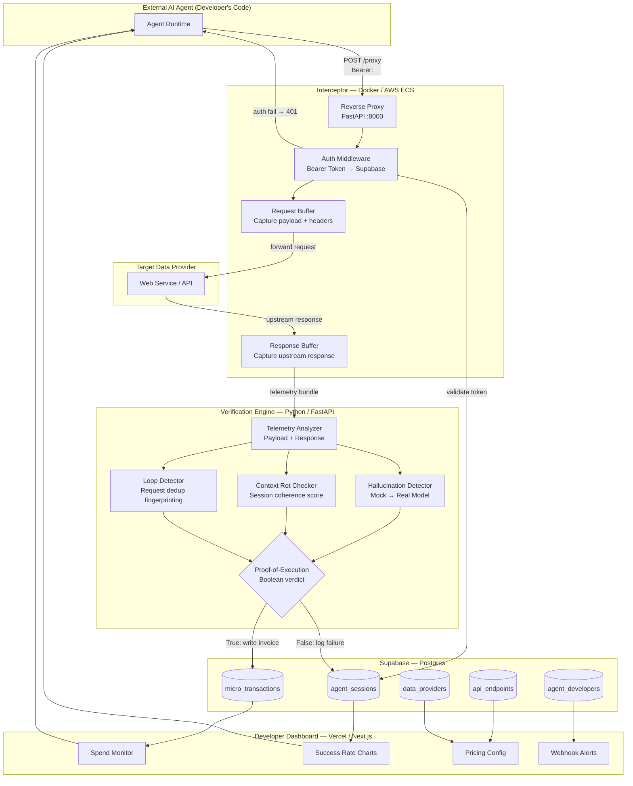

# System Architecture

## Data Flow Summary

| Step | Component | Action |
|------|-----------|--------|
| 1 | Agent | Sends HTTP request with Bearer token to Gateway |
| 2 | Interceptor | Validates token against `agent_sessions` in Supabase |
| 3 | Interceptor | Buffers request payload, forwards to target URL |
| 4 | Interceptor | Captures upstream response, bundles telemetry |
| 5 | Verification Engine | Runs hallucination + context rot + loop detection |
| 6 | Verification Engine | Emits `proof_of_execution: bool` verdict |
| 7 | Ledger | On `True`: writes `micro_transactions` row, debits developer wallet |
| 8 | Ledger | On `False`: updates session failure count, no charge |
| 9 | Dashboard | Streams spend, success rates, and alerts in real time |
